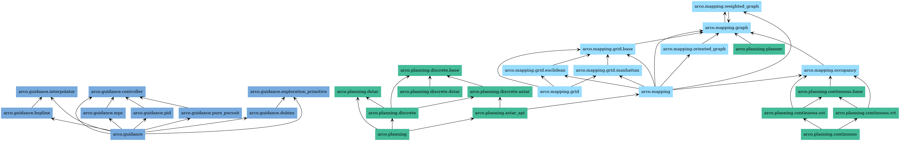

# ARCO: Autonomous Routing, Control, and Observation


ARCO is a Python library for autonomous navigation building blocks:

- Mapping representations for discrete and continuous spaces
- Planning algorithms for graph search and sampling-based exploration
- Guidance components for interpolation, motion primitives, and control

The project emphasizes clear architecture, testability, and documented algorithmic decisions.

## Documentation Index

- [Main docs index](docs/README.md)
- [Coding guidelines (authoritative)](docs/guidelines.md)
- [Contributing guide](CONTRIBUTING.md)
- [Planning overview](docs/PLANNING.md)
- [A* notes](docs/planning_astar.md)
- [D* notes](docs/planning_dstar.md)
- [Roadmap](docs/ROADMAP.md)



## Architecture

A planner operates on a map object:

- Discrete planners (A*, D*) operate on Grid structures
- Continuous planners (RRT, SST) operate on Occupancy structures

Core map families:

- Manhattan Grid: axis-aligned neighbors with Manhattan metric ($L_1$)
- Euclidean Grid: diagonal-capable neighbors with Euclidean metric ($L_2$)
- Occupancy: abstract continuous-space obstacle-query interface

Guidance is applied after planning:

- Exploration primitives: kinematic steering constraints for graph growth
- Interpolation: conversion of discrete plans into smooth trajectories
- Controllers: path tracking and control law generation

## Modules

- Mapping: spatial data structures and obstacle-query interfaces
- Planning: path search and sampling methods
- Guidance: trajectory shaping and feedback control

## Current Algorithm Status

| Algorithm | Status | Notes |
|-----------|--------|-------|
| A* | Done | Grid-based, configurable heuristics |
| D* | Next | Dynamic replanning for changing environments |
| RRT | Planned | Sampling-based for continuous state spaces |
| RRT* | Planned | Asymptotically optimal RRT variant |
| SST | Planned | Stable Sparse RRT for kinodynamic planning |

## Repository Layout

```text
.
├── config
├── docs
├── src/arco
│   ├── guidance
│   ├── mapping
│   └── planning
├── tests
└── tools
```

## Installation

```bash
git clone https://github.com/alexandrelheinen/arco.git
cd arco
pip install -e ".[dev]"
```

Requires Python 3.10+

## Development

### Run tests

```bash
pytest tests/ -v
```

### Format code

```bash
python -m black --target-version py312 src/ tests/
python -m isort src/ tests/
```

### Local examples

```bash
python tools/examples/astar_graph.py
python tools/examples/astar_grid_obstacle.py
python tools/examples/astar_manhattan.py
```

## CI and Merge Policy

GitHub Actions workflows run for pull requests and can be configured as required checks for merge protection on main.

Recommended required checks:

- Tests / Run unit tests
- A* Visualization Examples / astar-examples
- Pyreverse / pyreverse

## Contributing

Before contributing, follow [CONTRIBUTING.md](CONTRIBUTING.md) and the conventions in [docs/guidelines.md](docs/guidelines.md).

## References

Theory notes are under [docs](docs/). Core references:

- Hart, Nilsson, Raphael (1968). A Formal Basis for the Heuristic Determination of Minimum Cost Paths.
- Stentz (1994). Optimal and Efficient Path Planning for Partially-Known Environments.
- LaValle (1998). Rapidly-Exploring Random Trees: A New Tool for Path Planning.
- LaValle (2006). Planning Algorithms. Cambridge University Press.
- Karaman, Frazzoli (2011). Sampling-based Algorithms for Optimal Motion Planning.
- Li et al. (2016). Asymptotically Optimal Sampling-based Kinodynamic Planning.

## License

MIT License. See [LICENSE](LICENSE).
