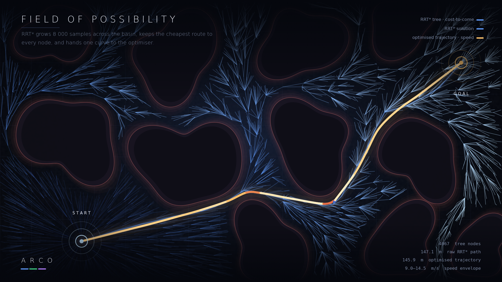

# ARCO


ARCO (Algorithms for Robotic Control and Optimization) is a library of
autonomous navigation building blocks: mapping, planning, and guidance/control.
The algorithms are compiled Rust reached through a Python interface, so
`import arco` works the way it always did.

<br clear="left">



Every curve above is solver output. See the
[illustration gallery](docs/GALLERY.md) for the other six plates, the
light-background print set, and how to regenerate them.

## Quick start

From a clean checkout to a recorded scenario.

```bash
git clone https://github.com/alexandrelheinen/arco.git
cd arco
python3 -m venv .venv
.venv/bin/pip install maturin
```

Build the extension in place. The first build compiles every crate and takes
a few minutes; later builds are incremental.

```bash
.venv/bin/python -m maturin develop --release
```

Check that the compiled module answers before spending time on a scenario.

```bash
.venv/bin/python -c "from arco._arco import version; print(version())"
```

The simulator needs the display extras on top of the library.

```bash
.venv/bin/pip install -e ".[tools]"
```

Run a scenario. The maps live in `map/`.

```bash
.venv/bin/arcosim map/city.yml -o /tmp/city.mp4 -d 3
```

Headless, which is what CI does:

```bash
SDL_AUDIODRIVER=dummy xvfb-run -a .venv/bin/arcosim map/occ.yml -o /tmp/occ.mp4 -d 3
```

Or let the smoke script pick the map and the output path:

```bash
PATH="$PWD/.venv/bin:$PATH" bash scripts/run_smoke_test.sh occ --duration 3
```

### Three things that cost time

**`-d` is video seconds, not run time.** Planning finishes before the first
frame is drawn. `map/occ.yml` asks for 30000 RRT* samples and 40000 SST
samples in a three-dimensional configuration space, so it runs about eight
minutes on an idle machine. `city` takes under two minutes, `rrp` about
three, `ppp` around twenty.

**Call the virtual environment's `arcosim` explicitly.** An older `arco`
installed elsewhere on `PATH` wins otherwise, and the failure reads as
`ModuleNotFoundError: No module named 'pygame'`, which looks like a missing
dependency and is the wrong interpreter.

**Do not wrap a run in `timeout`.** It kills the wrapper and leaves the
Python process running at full CPU, competing with whatever you start next.

## Documentation

- [Docs index](docs/README.md)
- [Public API reference](docs/API.md)
- [Coding guidelines](docs/guidelines.md) (authoritative)
- [Tech stack](docs/STACK.md)
- [Mapping](docs/MAPPING.md) · [Planning](docs/PLANNING.md) · [Guidance](docs/GUIDANCE.md)
- [Visualization (`arcosim`)](docs/VISUALIZATION.md) · [Illustration gallery](docs/GALLERY.md)
- [Roadmap](docs/ROADMAP.md)
- [Rust port](docs/rust/SPEC.md) · [Port deviations](docs/rust/DEVIATIONS.md)
- [Contributing](CONTRIBUTING.md)

## Architecture

Planners operate on map objects:

- Discrete planners (A*, route planning) use Grid or Graph structures
- Continuous planners (RRT*, SST) use Occupancy structures

Map families: `ManhattanGrid` (L₁), `EuclideanGrid` (L₂), graph hierarchy
(`Graph` → `WeightedGraph` → `CartesianGraph` → `RoadGraph`), and
`KDTreeOccupancy`.

Guidance and control run after planning: motion primitives, interpolation, and
feedback controllers (PID, Pure Pursuit, path-following MPC).

## Algorithm status

| Algorithm | Status | Notes |
|-----------|--------|-------|
| A* | Done | Grid and graph search |
| Route planning | Done | A* on road networks |
| RRT* | Done | Asymptotically optimal sampling |
| SST | Done | Sparse-tree geometric planning |
| D* Lite | Stub | Not planned — see [ROADMAP](docs/ROADMAP.md) |

## Repository layout

```text
.
├── benches/              performance baselines captured before the port
├── crates/               the Rust workspace, one crate per layer
│   ├── arco-core/        geometry, errors, protocols, the RNG
│   ├── arco-mapping/     grids, graphs, occupancy
│   ├── arco-kinematics/  RR / RRP arm models
│   ├── arco-runtime/     bus, nodes, pipeline runner
│   ├── arco-planning/    discrete and continuous planners
│   ├── arco-control/     PID, pure pursuit, MPC, tracking
│   ├── arco-guidance/    interpolation, primitives, vehicles
│   └── arco-py/          the PyO3 bindings, built as arco._arco
├── docs/                 algorithm notes and design docs
├── map/                  arcosim scenario YAML files
├── scripts/              local CI helpers
├── src/arco/
│   ├── config/           shared YAML + palette helpers
│   ├── control/          PID, Pure Pursuit, MPC, tracking
│   ├── guidance/         interpolation, primitives, vehicles
│   ├── kinematics/       RR / RRP arm models
│   ├── mapping/          grids, graphs, occupancy
│   ├── middleware/       in-process typed bus
│   ├── pipeline/         pipeline node runner
│   ├── planning/         discrete + continuous planners
│   └── simulator/        arcosim CLI, scenes, rendering (Python)
├── tests/                mirrored unit tests
└── tools/                demos and recorded media
```

## Installation

Installing without building anything needs a wheel, which carries the
compiled extension and needs no Rust toolchain on the target machine.

```bash
pip install arco
```

Building from source needs the pinned Rust toolchain in
[rust-toolchain.toml](rust-toolchain.toml), which `rustup` installs on first
build.

```bash
pip install -e ".[dev]"
```

Optional extras:

```bash
pip install -e ".[tools]"  # arcosim simulator, real-time and video/stills
```

Python 3.10+. See [docs/STACK.md](docs/STACK.md) for details.

## Development

One script runs every gate, and CI runs that script and nothing else:
formatting, lints, the Rust and Python suites, the doc tests, the dependency
audit and the coverage floors.

```bash
bash scripts/validate.sh
```

The individual steps, when a full gate run is more than the change needs:

```bash
.venv/bin/python -m pytest tests/ -q
```

```bash
cargo nextest run
```

```bash
bash scripts/check_formatting.sh
```

A Rust change needs the extension rebuilt before the Python suite sees it.

```bash
.venv/bin/python -m maturin develop
```

Local examples:

```bash
arcosim map/city.yml
```

```bash
arcosim map/ppp.yml --still 300 -o output/ppp.png
```

## Contributing

Follow [CONTRIBUTING.md](CONTRIBUTING.md) and [docs/guidelines.md](docs/guidelines.md).

## References

- Hart, Nilsson, Raphael (1968). A Formal Basis for the Heuristic Determination of Minimum Cost Paths.
- LaValle (1998). Rapidly-Exploring Random Trees: A New Tool for Path Planning.
- LaValle (2006). Planning Algorithms. Cambridge University Press.
- Karaman, Frazzoli (2011). Sampling-based Algorithms for Optimal Motion Planning.
- Li et al. (2016). Asymptotically Optimal Sampling-based Kinodynamic Planning.

## License

MIT License. See [LICENSE](LICENSE).
